# Future-Academy app
Future -Academy This application is for parents to track their children's progress, monthly and seasonally, and the administrator can add a month or season, edit or delete any page or add a child's level rating monthly and seasonally 

 
 

## Requirements 

Android studio last version  
JDK 8  
Android SDK 32  
Supports API Level +26

 

## Screenshot
 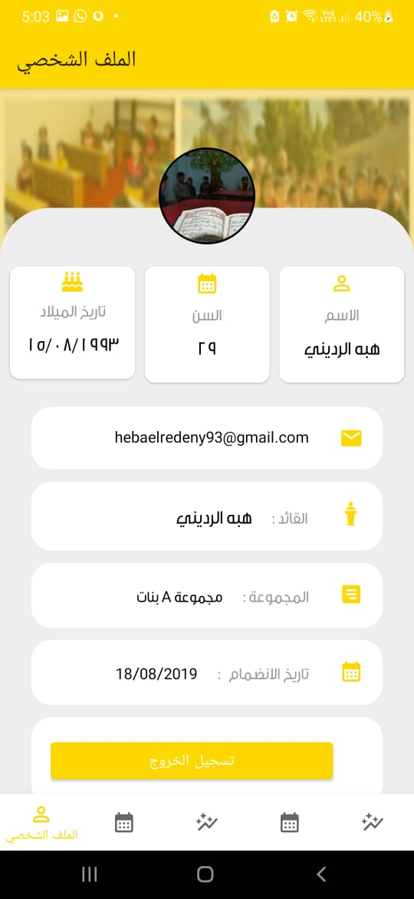  
   
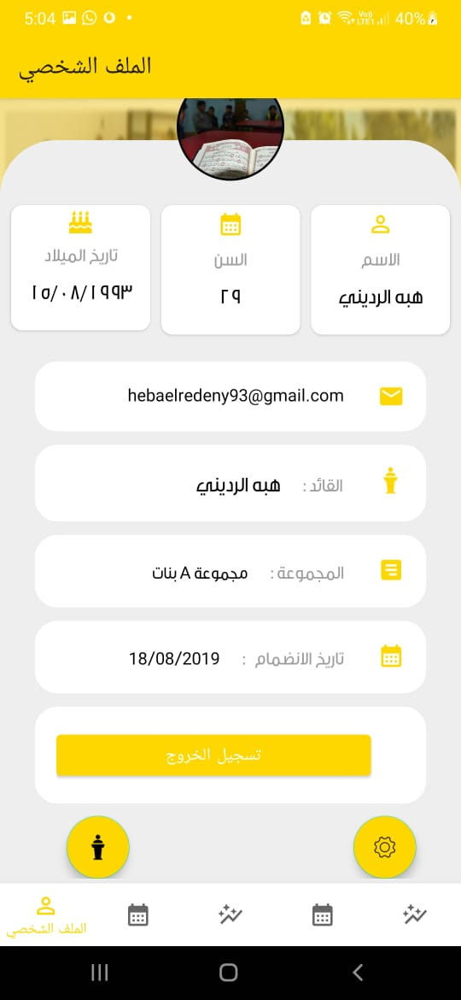   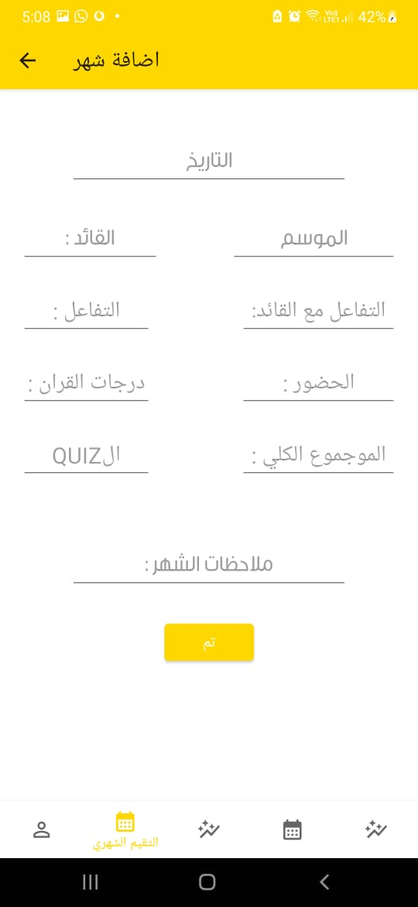
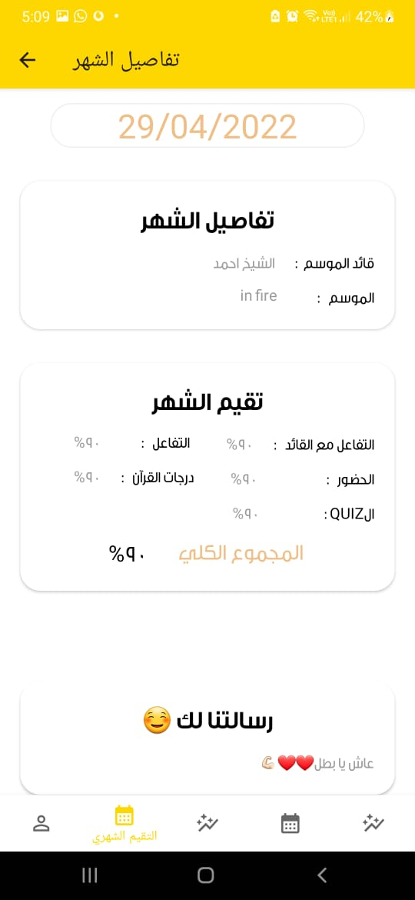 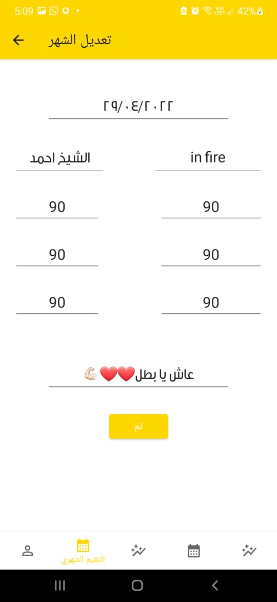 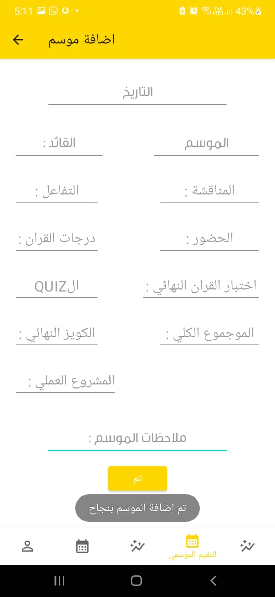 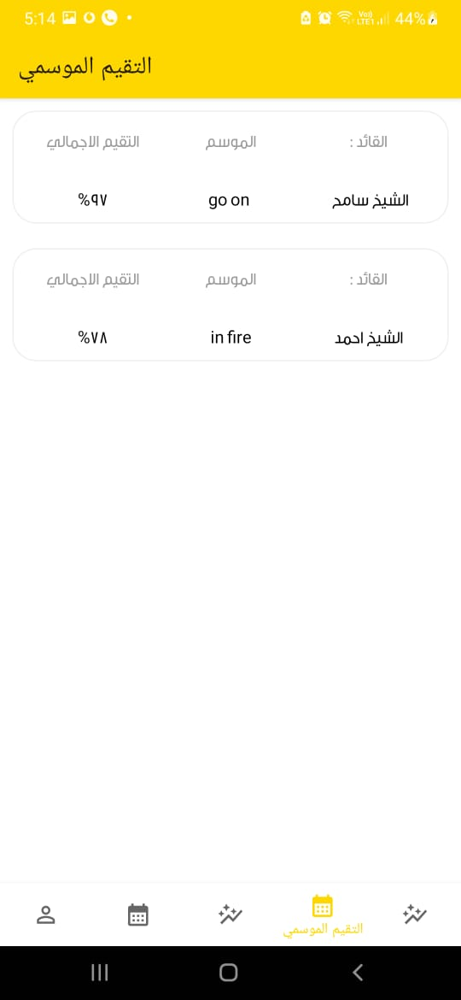
 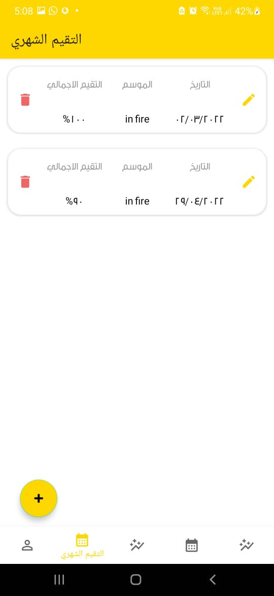 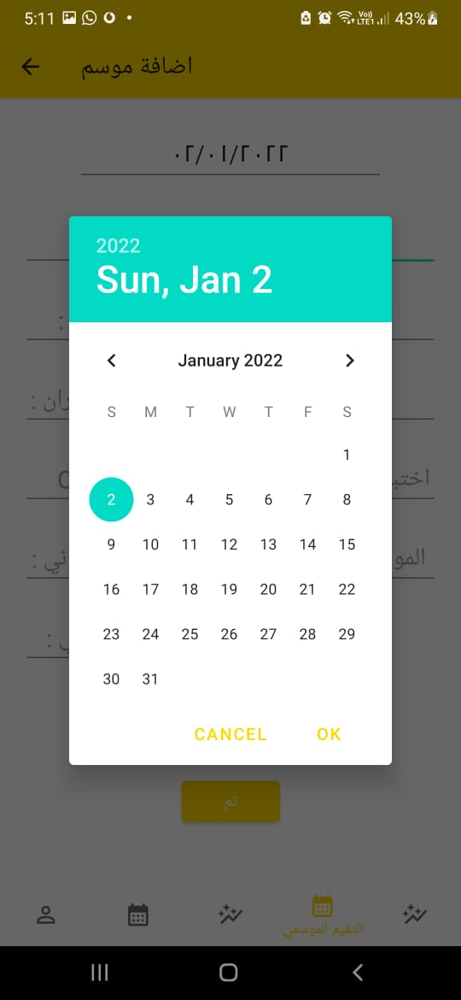 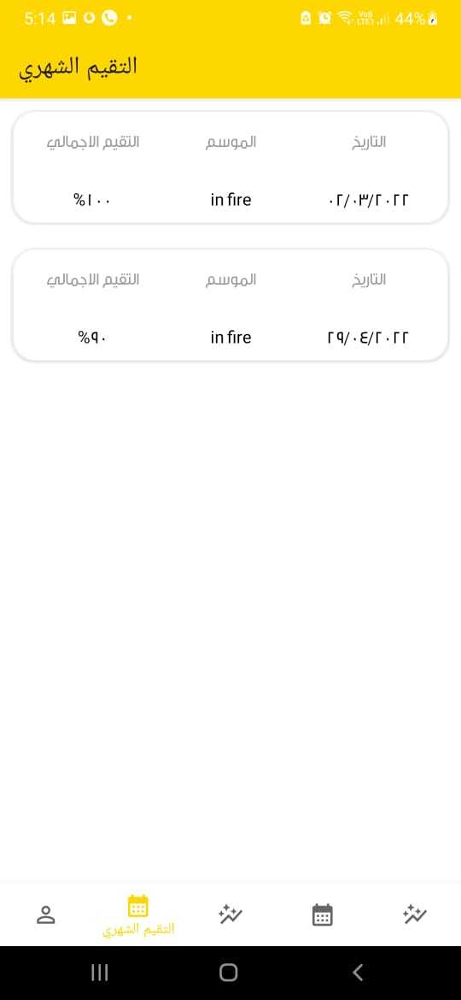
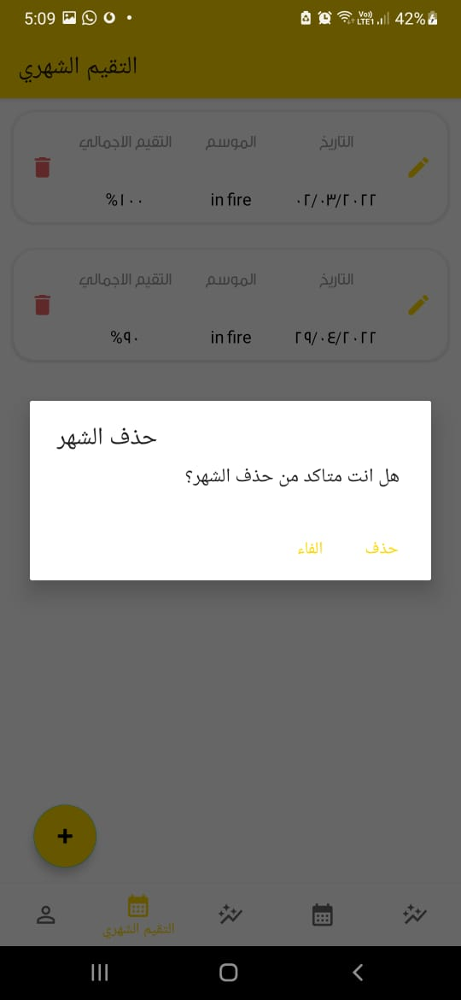 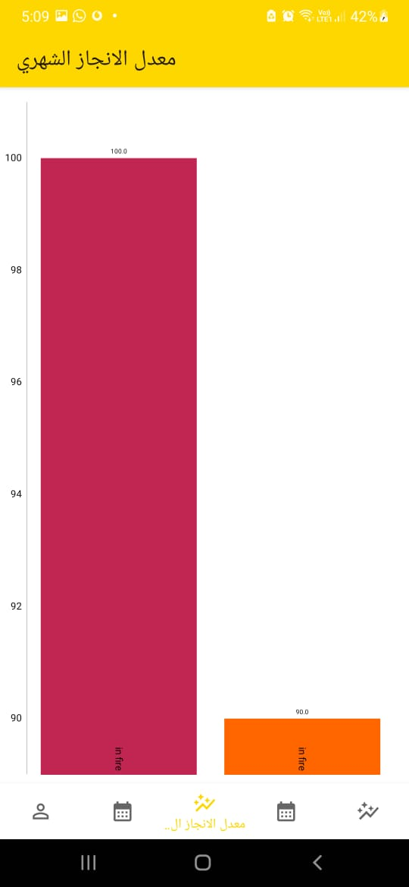 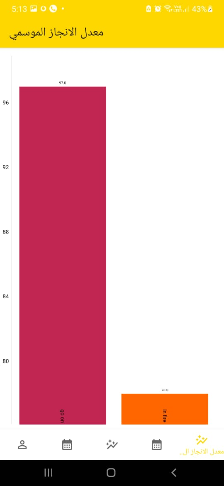  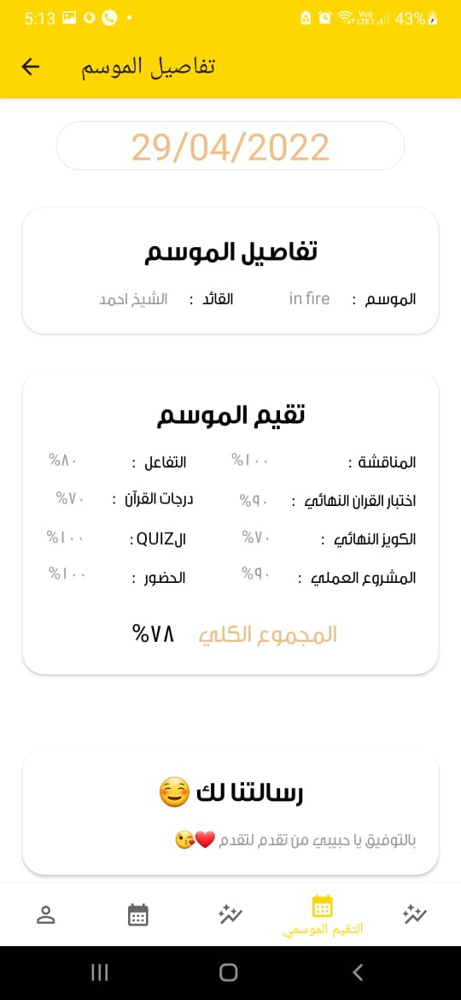
 

## Libraries and tools 🛠

Navigation  
Shared Preferences  
viewModel  
LiveData  
coroutine  
View Binding  
Firebase
Graph
Material Design
